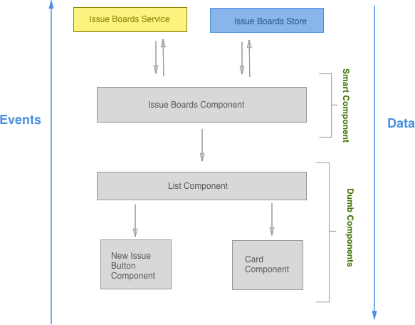

# Frontend Development Guidelines

This document describes various guidelines to ensure consistency and quality
across GitLab's frontend team.

## Overview

GitLab is built on top of [Ruby on Rails][rails] using [Haml][haml] with
[Hamlit][hamlit]. Be wary of [the limitations that come with using
Hamlit][hamlit-limits]. We also use [SCSS][scss] and plain JavaScript with
modern ECMAScript standards supported through [Babel][babel] and ES module
support through [webpack][webpack].

We also utilize [webpack][webpack] to handle the bundling, minification, and
compression of our assets.

Working with our frontend assets requires Node (v4.3 or greater) and Yarn
(v0.17 or greater).  You can find information on how to install these on our
[installation guide][install].

[jQuery][jquery] is used throughout the application's JavaScript, with
[Vue.js][vue] for particularly advanced, dynamic elements.

### Browser Support

For our currently-supported browsers, see our [requirements][requirements].

---

## Development Process

When you are assigned an issue please follow the next steps:

### Divide a big feature into small Merge Requests
1. Big Merge Request are painful to review. In order to make this process easier we
must break a big feature into smaller ones and create a Merge Request for each step.
1. First step is to create a branch from `master`, let's call it `new-feature`. This branch
will be the recipient of all the smaller Merge Requests. Only this one will be merged to master.
1. Don't do any work on this one, let's keep it synced with master.
1. Create a new branch from `new-feature`, let's call it `new-feature-step-1`. We advise you
to clearly identify which step the branch represents.
1. Do the first part of the modifications in this branch. The target branch of this Merge Request
should be `new-feature`.
1. Once `new-feature-step-1` gets merged into `new-feature` we can continue our work. Create a new
branch from `new-feature`, let's call it `new-feature-step-2` and repeat the process done before.

```shell
master
└─ new-feature
   ├─ new-feature-step-1
   ├─ new-feature-step-2
   └─ new-feature-step-3
```

**Tips**
- Make sure `new-feature` branch is always synced with `master`: merge master frequently.
- Do the same for the feature branch you have opened. This can be accomplished by merging `master` into `new-feature` and `new-feature` into `new-feature-step-*`
- Avoid rewriting history.

### Share your work early
1. Before writing code guarantee your vision of the architecture is aligned with
GitLab's architecture.
1. Add a diagram to the issue and ask a Frontend Architecture about it.

  

1. Don't take more than one week between starting work on a feature and
sharing a Merge Request with a reviewer or a maintainer.

### Vue features
1. Follow the steps in [Vue.js Best Practices](vue.md)
1. Follow the style guide.
1. Only a handful of people are allowed to merge Vue related features.
Reach out to one of Vue experts early in this process.


---

## [Architecture](architecture.md)
How we go about making fundamental design decisions in GitLab's frontend team
or make changes to our frontend development guidelines.

---

## [Testing](testing.md)
How we write frontend tests, run the GitLab test suite, and debug test related
issues.

---

## [Design Patterns](design_patterns.md)
Common JavaScript design patterns in GitLab's codebase.

---

## [Vue.js Best Practices](vue.md)
Vue specific design patterns and practices.

---

## Style Guides

### [JavaScript Style Guide](style_guide_js.md)

We use eslint to enforce our JavaScript style guides.  Our guide is based on
the excellent [Airbnb][airbnb-js-style-guide] style guide with a few small
changes.

### [SCSS Style Guide](style_guide_scss.md)

Our SCSS conventions which are enforced through [scss-lint][scss-lint].

---

## [Performance](performance.md)
Best practices for monitoring and maximizing frontend performance.

---

## [Security](security.md)
Frontend security practices.

---

## [Accessibility](accessibility.md)
Our accessibility standards and resources.


[rails]: http://rubyonrails.org/
[haml]: http://haml.info/
[hamlit]: https://github.com/k0kubun/hamlit
[hamlit-limits]: https://github.com/k0kubun/hamlit/blob/master/REFERENCE.md#limitations
[scss]: http://sass-lang.com/
[babel]: https://babeljs.io/
[webpack]: https://webpack.js.org/
[jquery]: https://jquery.com/
[vue]: http://vuejs.org/
[airbnb-js-style-guide]: https://github.com/airbnb/javascript
[scss-lint]: https://github.com/brigade/scss-lint
[install]: ../../install/installation.md#4-node
[requirements]: ../../install/requirements.md#supported-web-browsers

---

## [DropLab](droplab/droplab.md)
Our internal `DropLab` dropdown library.

* [DropLab](droplab/droplab.md)
* [Ajax plugin](droplab/plugins/ajax.md)
* [Filter plugin](droplab/plugins/filter.md)
* [InputSetter plugin](droplab/plugins/input_setter.md)
