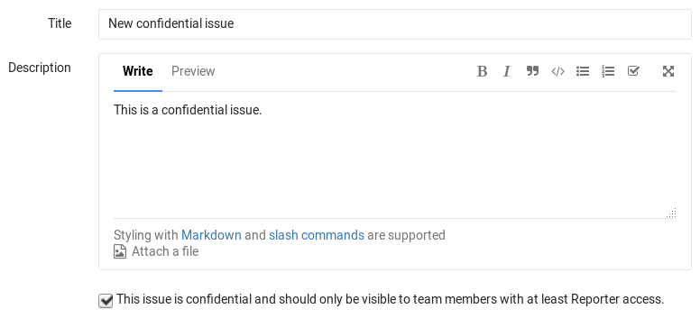
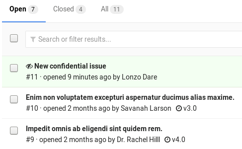
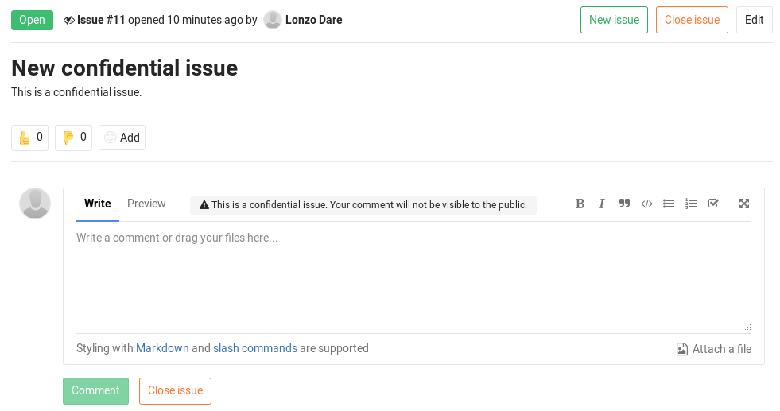

# Confidential issues

> [Introduced][ce-3282] in GitLab 8.6.

Confidential issues are issues visible only to members of a project with
[sufficient permissions](#permissions-and-access-to-confidential-issues).
Confidential issues can be used by open source projects and companies alike to
keep security vulnerabilities private or prevent surprises from leaking out.

## Making an issue confidential

You can make an issue confidential either by creating a new issue or editing
an existing one.

When you create a new issue, a checkbox right below the text area is available
to mark the issue as confidential. Check that box and hit the **Submit issue**
button to create the issue. For existing issues, edit them, check the
confidential checkbox and hit **Save changes**.

## Making an issue non-confidential

To make an issue non-confidential, all you have to do is edit it and unmark
the confidential checkbox. Once you save the issue, it will gain the default
visibility level you have chosen for your project.

Every change from regular to confidential and vice versa, is indicated by a
system note in the issue's comments.

## Indications of a confidential issue

>**Note:** If you don't have [enough permissions](#permissions-and-access-to-confidential-issues),
you won't be able to see the confidential issues at all.

There are a few things that visually separate a confidential issue from a
regular one. In the issues index page view, you can see the eye-slash icon
next to the issues that are marked as confidential.

---

Likewise, while inside the issue, you can see the eye-slash icon right next to
the issue number, but there is also an indicator in the comment area that the
issue you are commenting on is confidential.

## Permissions and access to confidential issues

There are two kinds of level access for confidential issues. The general rule
is that confidential issues are visible only to members of a project with at
least [Reporter access][permissions]. However, a guest user can also create
confidential issues, but can only view the ones that they created themselves.

Confidential issues are also hidden in search results for unprivileged users.
For example, here's what a user with Master and Guest access sees in the
project's search results respectively.

| Master access | Guest access |
| :-----------: | :----------: |
|  |  |

[permissions]: ../../permissions.md#project
[ce-3282]: https://gitlab.com/gitlab-org/gitlab-ce/merge_requests/3282
