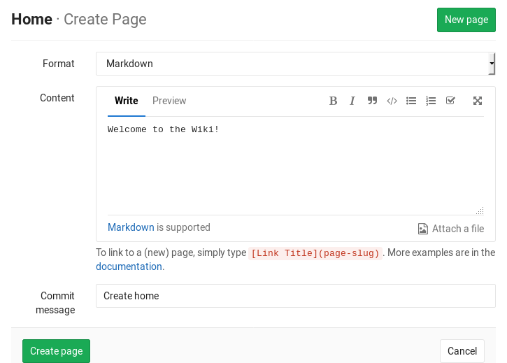
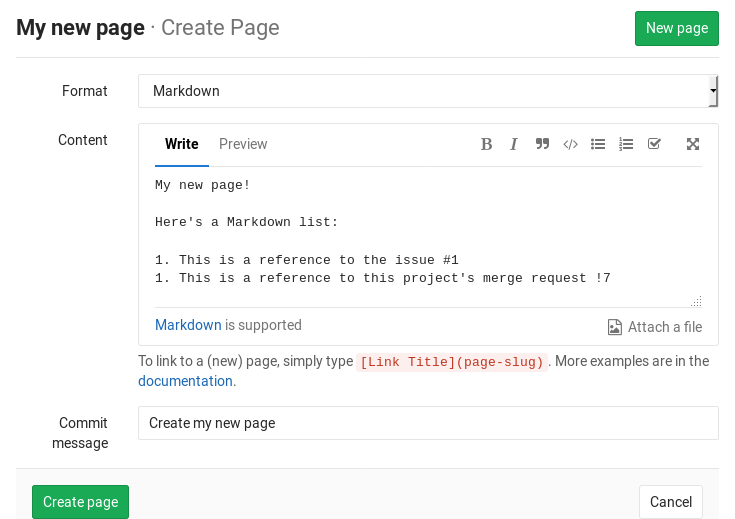
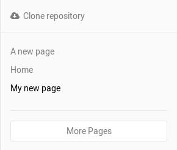

# Wiki

A separate system for documentation called Wiki, is built right into each
GitLab project. It is enabled by default on all new projects and you can find
it under **Wiki** in your project.

Wikis are very convenient if you don't want to keep you documentation in your
repository, but you do want to keep it in the same project where your code
resides.

You can create Wiki pages in the web interface or
[locally using Git](#adding-and-editing-wiki-pages-locally) since every Wiki is
a separate Git repository.

>**Note:**
A [permission level][permissions] of **Guest** is needed to view a Wiki and
**Developer** is needed to create and edit Wiki pages.

## First time creating the Home page

The first time you visit a Wiki, you will be directed to create the Home page.
The Home page is necessary to be created since it serves as the landing page
when viewing a Wiki. You only have to fill in the **Content** section and click
**Create page**. You can always edit it later, so go ahead and write a welcome
message.

## Creating a new wiki page

Create a new page by clicking the **New page** button that can be found
in all wiki pages. You will be asked to fill in the page name from which GitLab
will create the path to the page. You can specify a full path for the new file
and any missing directories will be created automatically.

Once you enter the page name, it's time to fill in its content. GitLab wikis
support Markdown, RDoc and AsciiDoc. For Markdown based pages, all the
[Markdown features](../../markdown.md) are supported and for links there is
some [wiki specific](../../markdown.md#wiki-specific-markdown) behavior.

>**Note:**
The wiki is based on a Git repository and contains only text files. Uploading
files via the web interface will upload them in GitLab itself, and they will
not be available if you clone the wiki repo locally.

In the web interface the commit message is optional, but the GitLab Wiki is
based on Git and needs a commit message, so one will be created for you if you
do not enter one.

When you're ready, click the **Create page** and the new page will be created.

## Editing a wiki page

To edit a page, simply click on the **Edit** button. From there on, you can
change its content. When done, click **Save changes** for the changes to take
effect.

## Deleting a wiki page

You can find the **Delete** button only when editing a page. Click on it and
confirm you want the page to be deleted.

## Viewing a list of all created wiki pages

Every wiki has a sidebar from which a short list of the created pages can be
found. The list is ordered alphabetically.

If you have many pages, not all will be listed in the sidebar. Click on
**More pages** to see all of them.

## Viewing the history of a wiki page

The changes of a wiki page over time are recorded in the wiki's Git repository,
and you can view them by clicking the **Page history** button.

From the history page you can see the revision of the page (Git commit SHA), its
author, the commit message, when it was last updated and the page markup format.
To see how a previous version of the page looked like, click on a revision
number.

## Adding and editing wiki pages locally

Since wikis are based on Git repositories, you can clone them locally and edit
them like you would do with every other Git repository.

On the right sidebar, click on **Clone repository** and follow the on-screen
instructions.

[permissions]: ../../permissions.md
