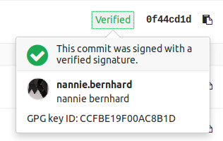
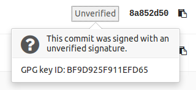

# Signing commits with GPG

## Getting started

- [Git Tools - Signing Your Work](https://git-scm.com/book/en/v2/Git-Tools-Signing-Your-Work)
- [Git Tools - Signing Your Work: GPG introduction](https://git-scm.com/book/en/v2/Git-Tools-Signing-Your-Work#_gpg_introduction)
- [Git Tools - Signing Your Work: Signing commits](https://git-scm.com/book/en/v2/Git-Tools-Signing-Your-Work#_signing_commits)

## How GitLab handles GPG

GitLab uses its own keyring to verify the GPG signature. It does not access any
public key server.

In order to have a commit verified on GitLab the corresponding public key needs
to be uploaded to GitLab.

For a signature to be verified two prerequisites need to be met:

1. The public key needs to be added to GitLab
1. One of the emails in the GPG key matches your **primary** email

## Add a GPG key

1. On the upper right corner, click on your avatar and go to your **Settings**.

    

1. Navigate to the **GPG keys** tab.

    

1. Paste your **public** key in the 'Key' box.

    

1. Finally, click on **Add key** to add it to GitLab. You will be able to see
   its fingerprint, the corresponding email address and creation date.

    

>**Note:**
Once you add a key, you cannot edit it, only remove it. In case the paste
didn't work, you will have to remove the offending key and re-add it.

## Remove a GPG key

1. On the upper right corner, click on your avatar and go to your **Settings**.

1. Navigate to the **GPG keys** tab.

1. Click on the trash icon besides the GPG key you want to delete.

>**Note:**
Removing a key **does not unverify** already signed commits. Commits that were
verified by using this key will stay verified. Only unpushed commits will stay
unverified once you remove this key.

## Revoke a GPG key

1. On the upper right corner, click on your avatar and go to your **Settings**.

1. Navigate to the **GPG keys** tab.

1. Click on **Revoke** besides the GPG key you want to delete.

>**Note:**
Revoking a key **unverifies** already signed commits. Commits that were
verified by using this key will change to an unverified state. Future commits
will also stay unverified once you revoke this key. This action should be used
in case your key has been compromised.

## Verifying commits

1. Within a project navigate to the **Commits** tag. Signed commits will show a
   badge containing either "Verified" or "Unverified", depending on the
   verification status of the GPG signature.

    

1. By clicking on the GPG badge details of the signature are displayed.

    

    
